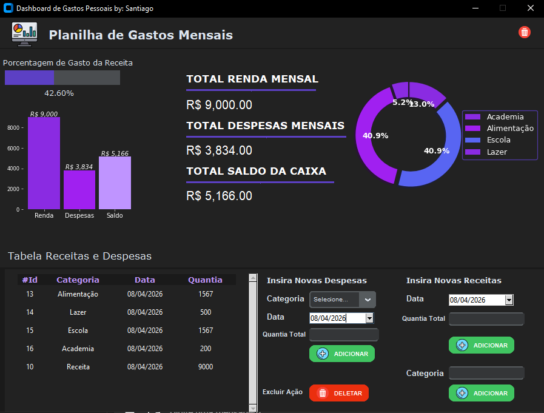

# Dashboard de Gastos Pessoais
Projeto desenvolvido em Python utilizando CustomTkinter e SQLite.

## Funcionalidades
- Cadastro de receitas e despesas.
- Gráficos dinâmicos com Matplotlib.
- Filtros por categoria.
- Reset mensal de dados.

# Programa Desenvolvido Por: Santiago Emanuel.